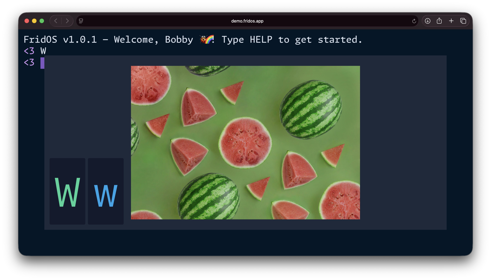

# FridOS

[](https://demo.fridos.app)

> **[Live Demo](https://demo.fridos.app)**

A kid-friendly terminal where children explore computers, learn typing, discover letters, numbers, and math — all while having a blast. Built with [Nuxt 4](https://nuxt.com), [Vue 3](https://vuejs.org), and [xterm.js](https://xtermjs.org).

FridOS gives kids their own "operating system" that feels real and exciting. Parents clone the repo, personalize it for their child, and let them loose on the keyboard.

## Quick Start

```bash
git clone https://github.com/sebimalwieder/FridOS.git
cd fridos
pnpm install
pnpm dev
```

Open `http://localhost:3000` — your kid's terminal is ready.

## Configuration

Personalize FridOS via environment variables — no code changes needed. Copy the example file and edit:

```bash
cp .env.example .env
```

| Variable | Default | Description |
|----------|---------|-------------|
| `NUXT_PUBLIC_NAME` | `Kid` | Your kid's name |
| `NUXT_PUBLIC_PROMPT_SYMBOL` | `>` | Terminal prompt symbol |
| `NUXT_PUBLIC_PROMPT_COLOR` | `MAGENTA` | Prompt color (`RED`, `GREEN`, `YELLOW`, `BLUE`, `MAGENTA`, `CYAN`, `WHITE`) |
| `NUXT_PUBLIC_WELCOME_MESSAGE` | `FridOS v{{version}} — Welcome, {{name}}!...` | Welcome message (`{{name}}` and `{{version}}` are interpolated) |
| `NUXT_PUBLIC_EMOJIS` | `💖,🦄,🍍,🥐,...` | Comma-separated emojis for the number command |

The terminal theme (colors, font size) lives in `app.config.ts` for more complex customization.

## What Kids Can Do

| Command | What it does |
|---------|-------------|
| Type any **letter** | Shows an image starting with that letter (A = Apple) |
| Type a **number** | Floods the screen with that many emojis |
| Type **math** (e.g. `3+4`) | Shows the result |
| `say hello` | Computer speaks out loud (Web Speech API) |
| `click` | Play the clicker game |
| `clock` | Shows an analog clock |
| `mom` / `dad` | Shows a random photo of mom or dad |
| `help` | Lists all available commands |
| `clear` | Clears the screen |
| `exit` | Closes the window |

Press **Escape** to dismiss images, games, or the clock at any time.

## Adding Your Own Images

### Alphabet Images

Drop images into `app/assets/img/alphabet/`. The filename determines which letter it maps to:

```
app/assets/img/alphabet/
  apple.jpg       <- shows when kid types "A"
  astronaut.png   <- also shows for "A" (random pick)
  banana.jpg      <- shows when kid types "B"
  cat.webp        <- shows when kid types "C"
```

Supported formats: `.jpg`, `.png`, `.webp`

### Family Photos

Drop photos into `app/assets/img/mom/` and `app/assets/img/dad/`. The `mom` and `dad` commands will show a random photo from these folders.

These are just two examples of **gallery commands** — see below for how to create your own for anyone your kid loves.

## Adding Commands

FridOS auto-discovers commands. Just drop a `.js` file in `app/utils/commands/`:

```js
// app/utils/commands/dinosaur.js

const globImages = import.meta.glob('~/assets/img/dinosaur/*.{jpg,png,webp}', {
  eager: true,
  import: 'default',
});
const images = Object.values(globImages);

export const dinosaur = () => {
  if (!images.length) return;
  const randomImage = images[Math.floor(Math.random() * images.length)];
  useImageViewer().value = { asset: randomImage, type: 'image' };
};

export const helpSummary = 'Show a dinosaur! 🦕';
```

That's it. No registration needed — the command appears in `help` automatically.

### Gallery Commands for Any Loved One

The `mom` and `dad` commands are just examples. Every family is different, and FridOS welcomes all of them. Create gallery commands for anyone your kid wants to see — grandma, uncle, big sister, best friend, a beloved pet:

1. Create a folder: `app/assets/img/grandma/`
2. Add photos
3. Copy `app/utils/commands/mom.js` to `grandma.js`
4. Change the function name, glob path, and help summary

### Command API

Every command file exports:
- A **named function** matching the filename — receives `(terminal, ...args)`
- `helpSummary` — one-line description shown in `help`
- Optionally `hidden = true` to hide from the help listing

## License

[MIT](./LICENSE)
